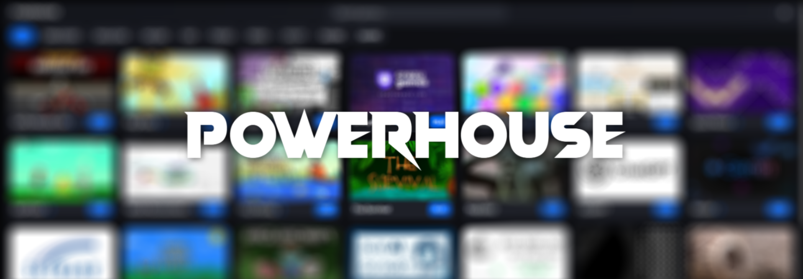

# Powerhouse

This project is a single-file HTML games hub built for computers and mobile. 

## Download 
### Local
If you're looking to run Powerhouse locally, download the [Loader here](https://github.com/ElliottC823/powerhouse/releases/tag/local)

## Integrating Powerhouse
If you are looking to integrate Powerhouse into a website, download the [Loader here](https://github.com/ElliottC823/powerhouse/releases/tag/local) and integrate it into the website.

## Platform Support

Any platform with a web browser that can run HTML 5 can run Powerhouse locally or online, though some games might not work.

## Features

- Games can open directly or through an about:blank proxy to bypass network filters.
- Large amounts of customization.
- Expanding library of games.
- Sort by game type.
